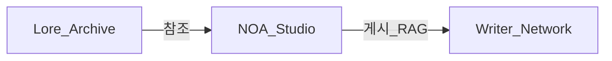

# EH Universe — 통합 실행 계획

Vertex RAG 인제스션, 복사본 디자인 이식, **QA·정찰에서 도출된 라우팅/인증/앵커 수정**을 한 로드맵으로 묶음.

**전체 풀 스캔 스냅샷·페이즈 실행표**: [eh-universe-full-scan-plan.md](./eh-universe-full-scan-plan.md) (인벤토리 31 페이지 / 16 API, 갭 G1~S3, Phase 0~4).

### 마스터 통합 매트릭스 (6관점)

| 관점 | 다루는 질문 | 위치 |
|------|-------------|------|
| 부족 | 무엇이 없거나 끊겼는가 | 풀 스캔 G1~G5, S1~S3; 축 A·E |
| 개선 | 기존 기능을 더 낫게 | 축 B·D·E·G·I, Phase 2~3 |
| 편의성 | 단계·클릭·학습 비용 | `/tools` 인덱스, 이중 제출 방지, 온보딩 |
| UI/UX | 시각·피드백·a11y | 축 B, E, F3·F4 |
| 운영성 | 배포·비용·관측·보안 | F6·F7·H, Sentry, Vertex |
| 유지보수 | 단일 소스·테스트 | `src/lib/tool-links.ts`, panel-registry, CI |

**갭 ID 요약**: G1~G5·S1·S2 코드 반영 완료(S3는 `proxy.ts` 중앙 정책 유지). **Phase 2 직렬화(E)** 는 `studio-share-serialize`로 핵심 보강. **B(복사본 디자인)·H(법무)·G 전량 승격**은 제품/인프라 결정 분기.

---

## 축 A — Network AI 인제스션 (RAG)

| 상태 | 내용 |
|------|------|
| 기존 | [`src/lib/vertex-network-agent.ts`](src/lib/vertex-network-agent.ts), [`src/lib/hooks/useNetworkAgent.ts`](src/lib/hooks/useNetworkAgent.ts), [`src/app/api/network-agent/ingest/route.ts`](src/app/api/network-agent/ingest/route.ts) |
| 구현 | [`ShareToNetwork`](src/components/studio/ShareToNetwork.tsx): 게시 후 `ingestAgent`, 인제스트 실패 시 UI 경고(게시 유지). |

**작업 (완료 기준)**

1. `ShareToNetwork`에 `useNetworkAgent` 연동.
2. `ingestAgent({ documentId: postRecord.id, title, content, planetId, isPublic }, user.uid)`.
3. 네 가지 공유 유형 동일 파이프라인.
4. Vertex 실패 시 게시 유지 + 경고 문구; 서버/훅은 [`@/lib/logger`](src/lib/logger) 사용.

**후속 (별 스프린트)**

- 감사 아티팩트 기준 Share 밖 스튜디오 영역 직렬화.
- 선택: `structData`에 `sourceType` / `shareType` — GCP Data Store 스키마와 정합.

---

## 축 B — 복사본 디자인 이식

참고: `eh-universe-web - 복사본`

| 항목 | 작업 |
|------|------|
| [`globals.css`](src/app/globals.css) `@theme` | 남색 베이스, 다층 그라데이션, `--shadow-manuscript` 등 토큰 병합 |
| [`layout.tsx`](src/app/layout.tsx) | Cormorant / Noto Serif KR 등 폰트 변수, `html` 클래스 |
| 스플래시 [`page.tsx`](src/app/page.tsx) | 복사본(sessionStorage+자동 닫힘) vs 메인(수동) — **제품 결정 후** 단일 커밋 |

---

## 축 C — QA·정찰 반영 (라우팅·앵커·인증)

정적 분석으로 확정된 항목을 계획에 포함.

### C1. `/tools` 404

- [`ToolNav`](src/components/tools/ToolNav.tsx)가 `href="/tools"`를 사용하나 **`src/app/tools/page.tsx` 없음**.
- **작업**: `src/app/tools/page.tsx` 추가(도구 목록). `TOOL_LINKS`를 [`ToolNav`](src/components/tools/ToolNav.tsx)와 **단일 모듈**로 공유하면 유지보수에 유리.

### C2. About 앵커 (Settings 푸터)

- [`SettingsView`](src/components/studio/SettingsView.tsx): `Privacy` → `/about#privacy`, `Terms` → `/about#license`.
- [`about/page.tsx`](src/app/about/page.tsx): 해당 **`id` 누락** 가능성.
- **작업**: `id="license"`(라이선스 섹션), `id="privacy"` + 짧은 Privacy 문단 또는 기존 섹션에 앵커.

### C3. Network Agent Bearer / userId

- **구현**: [`/api/network-agent/ingest`](src/app/api/network-agent/ingest/route.ts)·[`search`](src/app/api/network-agent/search/route.ts)는 `Authorization: Bearer <Firebase ID 토큰>`을 [`verifyFirebaseIdToken`](src/lib/firebase-id-token.ts)(`jose` + Google JWKS)으로 검증 후 `sub`을 `userId`로 사용. 클라이언트는 [`useNetworkAgent`](src/lib/hooks/useNetworkAgent.ts)에서 `getIdToken()` 전달, 검색 캐시 키는 `userKey`(uid)로 분리.

### C4. 브라우저 카오스·궤적 분석 (재검증)

- 본 항목은 **로컬/스테이징**에서 Playwright·수동으로 수행.
- 시나리오: 빈 입력·긴 문자열·XSS 유사 문자열·연타·Slow 3G/Offline·뒤로 가기.
- **작업**: 필요 시 `e2e/tools-index.spec.ts`( `/tools` 200 ), about 앵커 스크롤 스모크 추가.

---

## 권장 실행 순서

| 순서 | 축 | 내용 |
|------|-----|------|
| 1 | C1 | `/tools` 인덱스 페이지 + 링크 단일화 |
| 2 | C2 | About `id` / Privacy 섹션 |
| 3 | A | `ShareToNetwork` → `ingestAgent` |
| 4 | C3 | Network Agent 무토큰 동작 정책 |
| 5 | B | globals + layout 타이포·토큰 |
| 6 | B | (선택) 스플래시 정책 |
| 7 | C4 | e2e·카오스 시나리오 보강 |

**대안**: RAG 우선이면 순서 `3 → 4 → 1 → 2`.

---

## 검증 체크리스트

- [x] `/tools` HTTP 200, 목록 노출
- [x] 설정에서 Privacy/Terms → About 앵커 스크롤
- [ ] 스튜디오 공유 후 Vertex 검색에 문서 반영(스테이징·`AGENT_BUILDER_*`·Vertex 전제)
- [x] Network Agent: Firebase ID 토큰 없으면 401 / 클라이언트 스킵
- [x] `next build` + Jest 전부; e2e `tools-about` 스모크

---

## 할 일 (TODO)

- [x] C1: `tools/page.tsx` + [`tool-links`](src/lib/tool-links.ts)
- [x] C2: `about` 앵커 + Privacy
- [x] A: `ShareToNetwork` + `ingestAgent` + 직렬화 보강([`studio-share-serialize`](src/lib/studio-share-serialize.ts))
- [x] C3: JWT 검증 + `useNetworkAgent` idToken
- [ ] B: 복사본 `globals` + `layout` 폰트(디자인 소스 확정 시)
- [ ] B: (선택) 스플래시 정책 단일화
- [x] C4: [`e2e/tools-about.spec.ts`](e2e/tools-about.spec.ts) 스모크

---

## 축 D — 하드닝·관측성 (전역, 스튜디오 공통)

| 항목 | 내용 |
|------|------|
| 인증 | Network Agent: [`verifyFirebaseIdToken`](src/lib/firebase-id-token.ts). `/api/chat`: Bearer가 유효한 Firebase ID 토큰이면 `userTier` free; `PRO_LOCKED`는 예약 프로 플래그. 로그인 사용자는 [`streamViaProxy`](src/lib/ai-providers.ts)가 `getIdToken()`을 붙임. |
| 로깅 | [`useNetworkAgent`](src/lib/hooks/useNetworkAgent.ts) 등 `console.*` → `@/lib/logger`. |
| UX | 게시·저장 버튼 **이중 제출 방지** (`submitting` / debounce). |
| 일관성 | [`TOOL_LINKS`](src/lib/tool-links.ts) 단일 모듈 + Header·ToolNav 정합. |

---

## 축 E — 스튜디오별 개선·보완·추가

탭 라우팅 기준: [`AppTab`](src/lib/studio-types.ts) · [`StudioTabRouter`](src/components/studio/StudioTabRouter.tsx). 코드 스튜디오는 앱 내 [`/code-studio`](src/app/code-studio/page.tsx) 별도 셸.

### E1. 세계관 스튜디오 (`world` — [`WorldTab`](src/components/studio/tabs/WorldTab.tsx) / [`WorldStudioView`](src/components/studio/WorldStudioView.tsx))

| 구분 | 개선·보완 |
|------|-----------|
| RAG/공유 | [`buildShareWorldBible`](src/lib/studio-share-serialize.ts)로 2~3단계 세계관 필드 + `worldSimData` JSON(상한 자름) 포함. 추가 미세 조정은 제품 프리셋으로 확장 가능. |
| 데이터 | [`WorldSimData`](src/lib/studio-types.ts) 필드가 많음 → 큰 세션에서 **저장 크기/성능** 모니터링, 필요 시 요약 스냅샷 필드. |
| UX | 서브탭(설계/시뮬/분석 등) 전환 시 **미저장 경고** 일관성( [`useUnsavedWarning`](src/components/studio/UXHelpers.tsx) 와 연동 여부 점검). |

### E2. 캐릭터·아이템 스튜디오 (`characters` — [`CharacterTab`](src/components/studio/tabs/CharacterTab.tsx))

| 구분 | 개선·보완 |
|------|-----------|
| RAG/공유 | [`buildShareCharacterSheet`](src/lib/studio-share-serialize.ts): 심층 필드·[`CharRelation`](src/lib/studio-types.ts) 요약 포함. |
| AI | `generateCharacters`는 **Gemini 구조화** 전제 — 다른 프로바이더 선택 시 메시지는 있으나, **재시도/부분 실패** UX 통일. |
| 관계망 | 관계 그래프 UI가 있다면 **많은 노드** 시 가독성·필터(이미 있으면 문서화). |

### E3. 연출·집필 (`writing` — [`WritingTabInline`](src/components/studio/tabs/WritingTabInline.tsx))

| 구분 | 개선·보완 |
|------|-----------|
| 데이터 | [`buildShareEpisodeContent`](src/lib/studio-share-serialize.ts)가 에피소드 본문 뒤에 `sceneDirection` 요약 블록을 덧붙임. |
| UX | AI 생성 중 **취소·타임아웃**·에러 시 메시지 상태 복구( [`SectionErrorBoundary`](src/components/studio/SectionErrorBoundary.tsx) 범위 확인). |
| 카오스 | 연타 전송·탭 이탈 시 **진행 중 요청** 정리(AbortController 패턴이 있으면 일관 적용). |

### E4. 문체 스튜디오 (`style` — [`StyleTab`](src/components/studio/tabs/StyleTab.tsx))

| 구분 | 개선·보완 |
|------|-----------|
| RAG/공유 | [`buildShareStyleProfile`](src/lib/studio-share-serialize.ts): DNA 인덱스·슬라이더·체크 기법 목록. |
| 검증 | 슬라이더 극단값·빈 프로필일 때 **프롬프트 주입**이 어떻게 되는지 엔진 쪽과 주석/도움말로 명시. |

### E5. 원고 스튜디오 (`manuscript` — [`ManuscriptTab`](src/components/studio/tabs/ManuscriptTab.tsx))

| 구분 | 개선·보완 |
|------|-----------|
| RAG/공유 | 에피소드 공유는 assistant 메시지 기준 — **수동 편집본·메타 분석** 포함 여부 제품 결정. |
| 프라이버시 | 원문 전체 인제스트는 **용량·민감도** 이슈 → 요약 청크만 또는 옵트인. |

### E6. 비주얼 스튜디오 (`visual` — [`VisualTab`](src/components/studio/tabs/VisualTab.tsx))

| 구분 | 개선·보완 |
|------|-----------|
| RAG | 프롬프트 팩·레퍼런스는 Share 경로에 없을 수 있음 → **내보내기/인제스트 진입점** 별도(축 A 후속). |
| 자산 | 이미지·외부 URL **CSP/로딩 실패** 시 폴백 UI. |

### E7. 히스토리 / 룰북 / 문서 (`history`, `rulebook`, `docs`)

| 구분 | 개선·보완 |
|------|-----------|
| 탐색 | 세션·백업이 많을 때 **검색/필터** 성능( [`archiveFilter`](src/components/studio/StudioTabRouter.tsx) 등). |
| 룰북 | EH Rulebook 연동 깊이 — **오프라인/버전 고정** 필요 시 명시. |

### E8. 설정 (`settings` — [`SettingsView`](src/components/studio/SettingsView.tsx))

| 구분 | 개선·보완 |
|------|-----------|
| 법무 | Privacy/Terms 링크 → 축 **C2** (앵커). |
| 키 | API 키 **로컬 저장** 정책은 About/보안 문구와 한 줄 정렬. |

### E9. 코드 스튜디오 (`/code-studio` — WebContainer)

| 구분 | 개선·보완 |
|------|-----------|
| 환경 | COEP/COOP·CSP는 [`proxy.ts`](src/proxy.ts)에서 이미 분기 — **브라우저 호환** 이슈 시 사용자 안내. |
| 패널 | [`core/panel-registry`](src/lib/code-studio/core/panel-registry.ts) 규칙 유지 — 새 패널은 레지스트리 경유. |

---

## 스튜디오 축 우선순위 (참고)

1. **RAG 가치 빠른 승수**: 축 A 완료 후 E1/E2/E4 직렬화 보강.  
2. **사용자 신뢰**: E3 취소/에러, E5 프라이버시.  
3. **확장**: E6/E7 내보내기·검색.

---

## 축 F — 스튜디오 밖·횡단 (계획에 빠지기 쉬운 항목)

스튜디오 탭(E)만이 아니라 **같은 앱**에서 같이 챙길 만한 영역.

### F1. 작가 네트워크 (`/network/*`)

| 항목 | 내용 |
|------|------|
| 데이터 무결성 | 행성·게시·댓글 **권한**이 클라이언트+Firestore 규칙에 모두 맞는지 점검(서버만 믿지 않기). |
| 스팸/남용 | 공개 게시에 **레이트 리밋**·신고 흐름이 없으면 로드맵에 명시. |
| 일관성 | 네트워크 작성 플로우는 이미 `ingestAgent` 일부 연동 — 스튜디오 축 A와 **문서 ID·메타** 정책 통일. |

### F2. API·백엔드

| 항목 | 내용 |
|------|------|
| 레이트 리밋 | `/api/chat`, `/api/network-agent/*`, 이미지 생성 등 **비용·남용** 방지(Edge Config / 미들웨어 / Upstash 등). |
| 인증 | 축 D·C3 — Bearer 문자열 그대로 `userId` 쓰는 패턴 **전 구간** 목록화 후 제거. |
| Cron | [`universe-daily`](src/app/api/cron/universe-daily/route.ts) 등 TODO(실제 insert) 완성 여부. |

### F3. 접근성·국제화·SEO

| 항목 | 내용 |
|------|------|
| a11y | 모달 포커스 트랩, 스킵 링크, 대비 — **핵심 플로우**(스튜디오·로그인)만이라도 체크리스트. |
| i18n | `L4` / `createT` 혼용 구간에서 **누락·하드코딩 문자열** 스캔. |
| SEO | 아카이브·문서·About 등 **메타/OG** 라우트별 점검(스튜디오는 `noindex` 필요할 수 있음). |

### F4. 성능·번들

| 항목 | 내용 |
|------|------|
| 코드 분할 | 이미 `dynamic` 다수 — **초기 LCP** 큰 탭(월드·코드) 우선 분석. |
| 이미지 | `next/image` 사용 일관성, 외부 도메인 `remotePatterns`. |

### F5. 데이터·백업·동기화

| 항목 | 내용 |
|------|------|
| IndexedDB 백업 | 버전 복구 UX·**손상 시** 복구 메시지. |
| Drive / 암호화 | [`driveService`](src/services/driveService.ts) — 키 분실·마이그레이션 문구. |

### F6. 관측·운영

| 항목 | 내용 |
|------|------|
| Sentry | 이미 의존성 존재 — **소스맵·환경**·PII 스크럽 정책. |
| Web Vitals | [`WebVitalsReporter`](src/components/WebVitalsReporter.tsx) 알림 임계값. |

### F7. 보안·컴플라이언스

| 항목 | 내용 |
|------|------|
| 의존성 | `npm audit` / Dependabot 주기. |
| 개인정보 | EU/한국 사용자 시 **쿠키 배너·동의** 필요 여부 제품 결정. |

### F8. 협업·로드맵(미구현 아이디어)

| 항목 | 내용 |
|------|------|
| 실시간 협동 | 동시 편집은 **범위 밖**이면 명시해 기대치 관리. |
| 모바일 스튜디오 | 터치·뷰포트 한계 — “권장 데스크톱” 안내 여부. |

---

## 범위 한눈에

- **A~C**: 이미 합의된 실행 묶음.  
- **D**: 전역 하드닝.  
- **E**: 탭별(스튜디오) 제품.  
- **F**: 네트워크·API·a11y·운영 등 **저거 말고도** 있는 영역.  
- **G**: 코드 스튜디오 고도화·고급화.  
- **H**: 한국 시장 출시·수익화(참고).  
- **I**: 유니버스·소설 스튜디오 고도화·고급화 — 아래.

---

## 축 G — 코드 스튜디오 고도화·고급화 전략

레포 구조: [`src/lib/code-studio/`](src/lib/code-studio/) (에디터·파이프라인·감사·AI·WebContainer 등), UI는 [`src/components/code-studio/`](src/components/code-studio/), 패널 정의는 [`panel-registry.ts`](src/lib/code-studio/core/panel-registry.ts) (`PanelStatus`: `stable` | `beta` | `stub`).

### 전략 원칙 (NOA / GEMINI 정합)

- 패널 추가·노출은 **`panel-registry.ts` + `PanelImports` 경유** — 하드코딩 금지.
- 로깅은 `console` 대신 `@/lib/logger`.
- 보안 헤더·CSP는 [`src/proxy.ts`](src/proxy.ts) 단일 정책(Code Studio는 WebContainer용 COEP/COOP 분기 이미 존재).

### 단계별 로드맵

**G1 — 거버넌스·신뢰도 (기반)**

| 방향 | 내용 |
|------|------|
| 상태 정직성 | 레지스트리의 `beta`/`stub`와 **실제 UI 동작**을 주기적으로 대조. 사용자에게 beta 배지·제한 안내 유지. |
| 단일 소스 | 패널·명령 팔레트·단축키 문자열 **중복 정의**가 있으면 레지스트리/상수로 수렴. |
| 회귀 방지 | `src/lib/code-studio/**/__tests__` 가 대량 존재 — **CI에서 `jest` + 핵심 패키지**가 항상 돌도록 고정(이미 스크립트 [`test`](package.json) 활용). |

**G2 — 핵심 루프 강화 (WebContainer + 편집)**

| 방향 | 내용 |
|------|------|
| 샌드박스 | 부팅 실패·타임아웃·메모리 — **재시도·상태 리셋·사용자 메시지** 일관 패턴. |
| 에디터 | Monaco 통합 구간: 대용량 파일·언어 서버 없을 때 **디그레이드** 명시. |
| 터미널·프리뷰 | 터미널 스트림·프리뷰 HMR 오류 시 **한 곳에 에러 집계**(관측 축 F6과 연동). |

**G3 — AI 층 고급화 (`beta` → `stable` 선별)**

| 패널(현재) | 방향 |
|------------|------|
| `agents`, `creator` (beta) | 실제 호출 경로·모델 비용·취소(Abort)를 끝까지 연결한 뒤 **stable 승격 기준** 문서화. |
| `composer`, `autopilot`, `ai-hub` | 멀티 파일 편집·파이프라인과 **충돌 없는 단일 “작업 단위”** (트랜잭션/롤백 UX). |
| `pipeline` / 감사 | [`pipeline/`](src/lib/code-studio/pipeline/), [`audit/`](src/lib/code-studio/audit/) — 리포트를 **한 번에 export**(JSON/Markdown)해 NOA 스튜디오·네트워크와 연계 여지. |

**G4 — 검증·품질 (이미 라이브러리가 두터움)**

| 방향 | 내용 |
|------|------|
| 파이프라인 | `pipeline-teams`, 버그파인더, 스트레스 테스트 등 — UI에서 **실패 시 원인 코드 위치**까지 링크하면 “고급화” 체감 상승. |
| 감사 엔진 | Audit 결과를 **프로젝트 메타**로 저장해 세션 간 비교(트렌드). |

**G5 — 협업·배포·통합 (후순위)**

| 패널 | 내용 |
|------|------|
| `collab` (beta) | 실시간 CRDT 등은 비용·인프라 큼 — **범위(읽기 전용 공유 vs 동시 편집)** 먼저 제품 결정. |
| `deploy`, `git-graph` | 배포 타깃(Vercel 등)과 시크릿은 **서버 라우트**와 정책 정합. |
| MCP / 외부 도구 | [`features`](src/lib/code-studio/features/) 쪽 확장 시 **권한·토큰**을 설정 패널과 한 흐름으로. |

### 고급화 vs 과잉

- **아키텍처 결함**(예: 브라우저 샌드박스 한계, 진짜 멀티 유저 Git)은 코드만으로 완화 어려우면 **[인간 개입 필요]**로 표시하고 문서화.
- “고급” 기능은 **기본 숨김(`isEssential`)** 유지로 복잡도 방어 — [`getVisiblePanels`](src/lib/code-studio/core/panel-registry.ts) 철학과 일치.

### E9와의 관계

- 축 **E9**는 코드 스튜디오 **운영·호환** 단편.  
- 축 **G**는 **전략·단계·패널 성숙도** 전체 로드맵.

---

## 축 H — 한국 시장 출시·수익화 (참고)

법률·세무는 **변호사/세무사 검토 필수**. 아래는 제품·엔지니어링 관점 체크리스트.

### H1. 라이선스·상업화

| 항목 | 내용 |
|------|------|
| 오픈 라이선스 | 프로젝트가 **CC-BY-NC** 등 비상업 기반인 경우, **유료 서비스·클로즈드 기능**과 어떻게 공존할지(별도 상업 라이선스·이중 라이선스·상표) 사전 정리. |
| 이용약관 | 한국어 **유료 서비스 약관**·취소·환불(전자상거래법·콘텐츠·구독 정책) 반영. |

### H2. 결제·정산

| 항목 | 내용 |
|------|------|
| PG | 국내 사용자 기대: 카드·간편결제(토스페이먼츠·나이스페이 등) — 해외 PG만 있으면 이탈 가능. |
| 세금계산서·현금영수증 | B2B·프로 크리에이터 대상이면 요구 발생 가능. |

### H3. 개인정보·보안 (국내)

| 항목 | 내용 |
|------|------|
| PIPA | 수집 항목·목적·보관 기간·제3자 제공 — **개인정보 처리방침** 한글·앵커(축 C2·E8과 연계). |
| 국내 호스팅/이전 | 클라우드 리전·Firebase 데이터 위치 — 마케팅 시 **안심 문구**는 사실에 맞게만. |

### H4. 제품·포지셔닝

| 항목 | 내용 |
|------|------|
| 페르소나 | 웹소설·세계관·스크립트 작가, 인디 팀 — **한 줄 가치 제안**(NOA/서사 붕괴 방지 등)을 국문 랜딩 상단에. |
| 경쟁 | 범용 AI 글쓰기와 차별 — **스튜디오 구조·룰북·네트워크**를 전면. |
| 가격 | 원화 표기·부가세 표시 관행·프로 모델 **토큰/크레딧 설명** 투명성. |

### H5. 운영·신뢰

| 항목 | 내용 |
|------|------|
| 고객 지원 | 카카오 채널·이메일·Discord 중 **하나는 확실히**; 응답 SLA는 과장 없이. |
| 장애 공지 | 상태 페이지 또는 공지 채널 — 크리에이터는 원고 유실에 민감(백업 메시지 강화 = F5·E 연계). |

### H6. 엔지니어링과의 접점

- 축 **D·C3** 인증·남용 방지 = 유료화 시 **필수**.
- 축 **F7** 쿠키/동의 = 국내 랜딩·가입 플로우.
- **A** Vertex/RAG 비용 = **원가** 반영해 요금제 설계.

---

## 축 I — 유니버스(EH Universe)·소설 스튜디오(NOA Studio) 고도화·고급화 전략

**유니버스**: 아카이브·보고서·코덱스·랜딩·네트워크 등 **읽기·탐색·커뮤니티** 전반.  
**소설 스튜디오**: [`/studio`](src/app/studio/page.tsx) — [`StudioShell`](src/app/studio/StudioShell.tsx)·[`StudioTabRouter`](src/components/studio/StudioTabRouter.tsx) 기준 **창작 루프**(세계관·캐릭터·집필·원고·문체 등). 코드 스튜디오(축 G)와 **별 축**.

### I1. 제품 아키텍처 — 세 층이 한 브랜드로 맞물리게

| 층 | 역할 | 고도화 방향 |
|----|------|-------------|
| **Lore / 읽기** | 아카이브·룰북·문서 | 검색·내비게이션·신뢰(출처·등급 배지) — “설정 읽고 → 스튜디오에서 쓰기” **진입 동선** 명시. |
| **Studio / 쓰기** | NOA 스튜디오 | 프로젝트·세션·[`StoryConfig`](src/lib/studio-types.ts)가 **단일 진실** — 내보내기·백업·RAG(축 A)와 스키마 정합. |
| **Network / 공유** | 행성·게시·에이전트 | 스튜디오 산출물이 네트워크·Vertex로 **끊기지 않게**(Share + ingest). |

### I2. 소설 스튜디오 — 핵심 창작 루프 강화

| 단계 | 방향 |
|------|------|
| **온보딩** | 가이드 vs 자유 모드 — 첫 성공까지 **에피소드 1개** 같은 마일스톤(이미 e2e에 유사 흐름). |
| **세계관→집필** | `config`가 집필·AI 프롬프트에 **항상 주입**되는 경로 점검(누락 시 “설정이 반영 안 됨” 이탈). |
| **엔진** | HFCP·Director·[`engine/`](src/engine/) — 리포트가 UI에서 **한눈에**(이미 Writing 쪽 위젯과 연계 가능성). |
| **연출·복선** | `sceneDirection`·긴장 곡선 — 데이터는 있으면(축 E3) **공유·RAG**까지 연결되면 “고급” 체감. |
| **신뢰** | 자동 저장·버전 백업·복구 — **원고 유실 불안** 완화(F5·E5와 동일 맥락). |

### I3. AI·RAG — “비싼 엔진”을 제품 가치로 전환

| 항목 | 내용 |
|------|------|
| 인제스트 | 축 **A** 완료 후, 스튜디오별 직렬화 보강(축 **E1~E5**). |
| 검색 | Network Agent 검색이 **내 세계관만** 잘 걸리게 필터·메타(`sourceType` 등) 장기 로드맵. |
| 비용 | 프롬프트 길이·재시도·캐시 정책 — 유료화 시 **투명한 크레딧**(축 H6). |

### I4. 차별화 — “범용 챗봇”이 아닌 이유를 유지

- **룰북·금기·연속성**을 제품 언어로 반복(랜딩·툴팁·온보딩).
- 세계관 데이터와 **갈등 구조**가 스튜디오 필드에 매핑되어 있으면 — 범용 AI 대비 **서사 일관성** 포지셔닝 유지.

### I5. 품질 바 — 고급화 vs 과잉

| 할 것 | 줄일 것 |
|-------|---------|
| 탭별 **완성도 라벨**(beta)과 도움말 | 기능 수만 늘리고 설명 없음 |
| 내보내기·인쇄·백업 **한 경로** | 숨은 메뉴 다층 구조 |
| i18n KO 우선 품질 | 영문만 완성된 카피 |

### I6. 다른 축과의 정리

| 축 | 관계 |
|----|------|
| **E** | 탭별 개선 목록 = 축 I의 **실행 디테일**. |
| **A** | RAG = I3의 **기술 다리**. |
| **G** | 코드 스튜디오 = **개발자·프롬프트 팩** 페르소나; 소설 스튜디오 = **작가** 페르소나 — 마케팅·온보딩에서 구분. |
| **H** | 국내 출시 시 I2 신뢰·I3 비용·I4 포지션이 **가격·약관**과 맞아야 함. |
